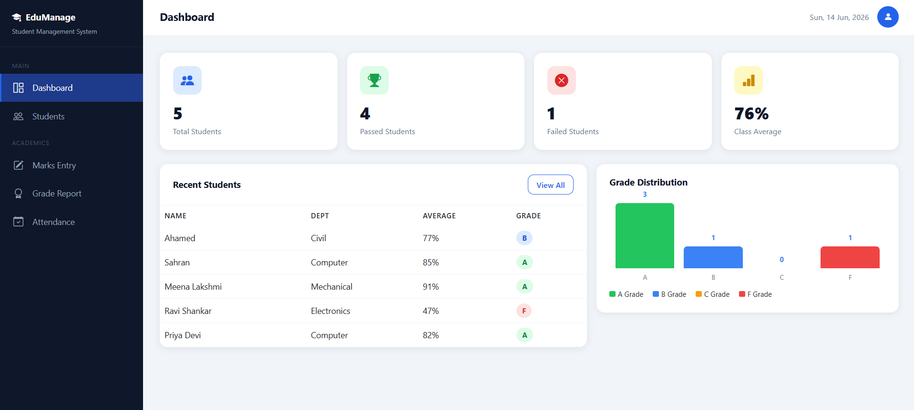

# 🎓 Student Management System

Live Demo: https://sahranhameed.github.io/Student-Management-System/

A modern and responsive Student Management System developed using HTML, CSS, Bootstrap, JavaScript, and jQuery.

## 🚀 Features

### 📊 Dashboard

* Total Students Overview
* Passed Students Count
* Failed Students Count
* Class Average Statistics
* Grade Distribution Chart

### 👨‍🎓 Student Management

* Add New Students
* Search Students
* Filter by Department
* Delete Student Records

### 📝 Marks Management

* Enter Subject-wise Marks
* Save Student Marks
* View Marks Overview
* Calculate Total and Average

### 🏆 Grade Report

* Automatic Grade Calculation
* Pass / Fail Status
* Performance Progress Bar
* Printable Report

### 📅 Attendance Management

* Mark Daily Attendance
* Mark All Present / Absent
* Attendance Summary
* Attendance Percentage Tracking

## 🛠️ Technologies Used

* HTML5
* CSS3
* Bootstrap 5
* JavaScript (ES6)
* jQuery
* Bootstrap Icons

## 📂 Project Structure

student-management-system/
│
├── index.html
├── style.css
├── script.js
├── screenshot.png/

## 💻 How to Run

1. Download or Clone the Repository
2. Open the project folder
3. Open index.html in your browser

## 🎯 Learning Outcomes

* DOM Manipulation
* CRUD Operations
* Dashboard Design
* Data Management using JavaScript
* Responsive Web Design
* Bootstrap Components

## 📸 Screenshots

---

## 👨‍💻 Author

**Sahran Hameed**
- GitHub: [@SahranHameed](https://github.com/SahranHameed)
- LinkedIn: [Sahran Hameed](https://www.linkedin.com/in/sahran-hameed/)
- Portfolio: [sahranhameed.github.io](https://sahranhameed.github.io/My-Portfolio/)

Frontend Developer | Full Stack Learner | Networking & Cloud Security Enthusiast

## ⭐ If you like this project 

Give it a Star on GitHub.⭐